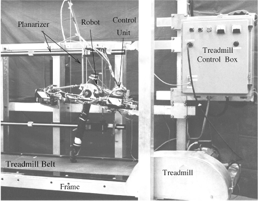
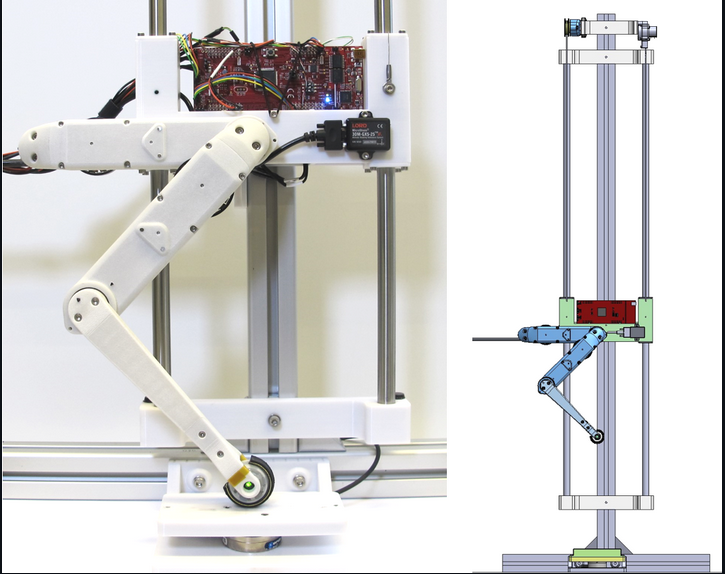
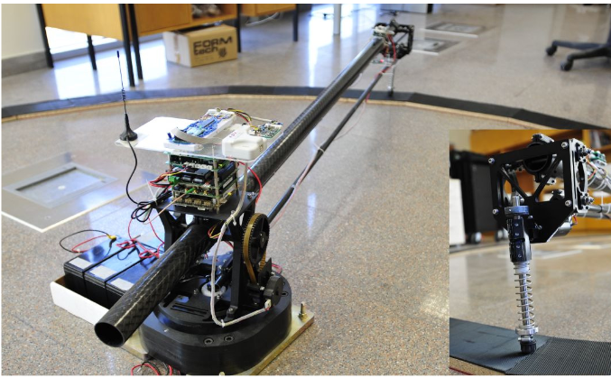
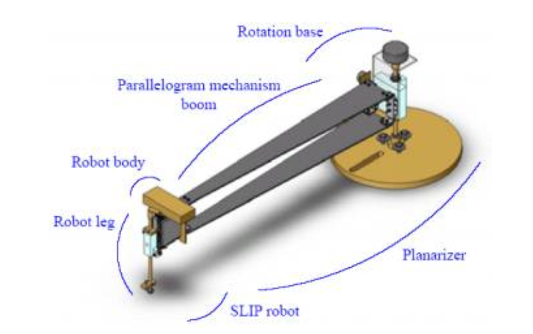
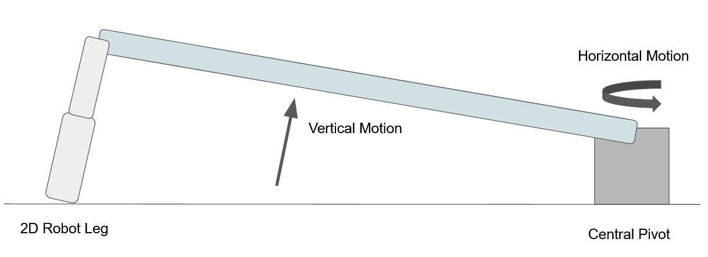
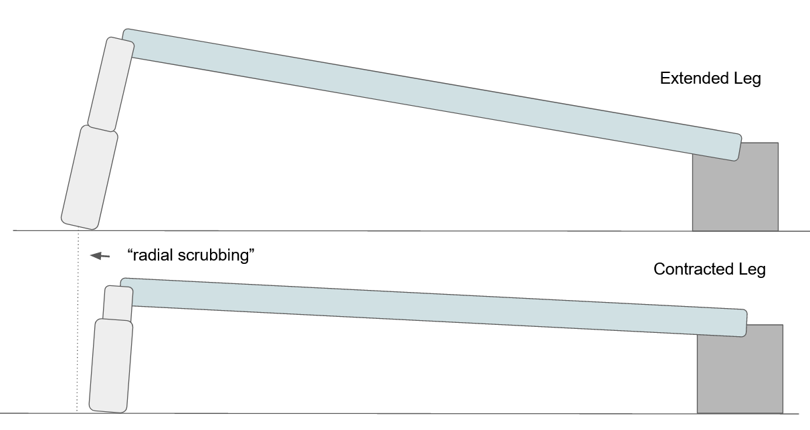
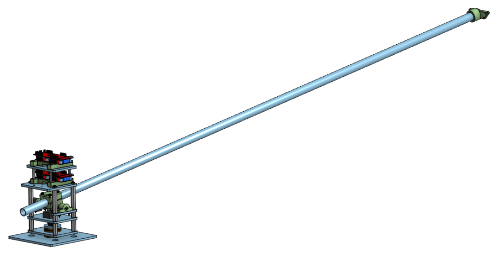
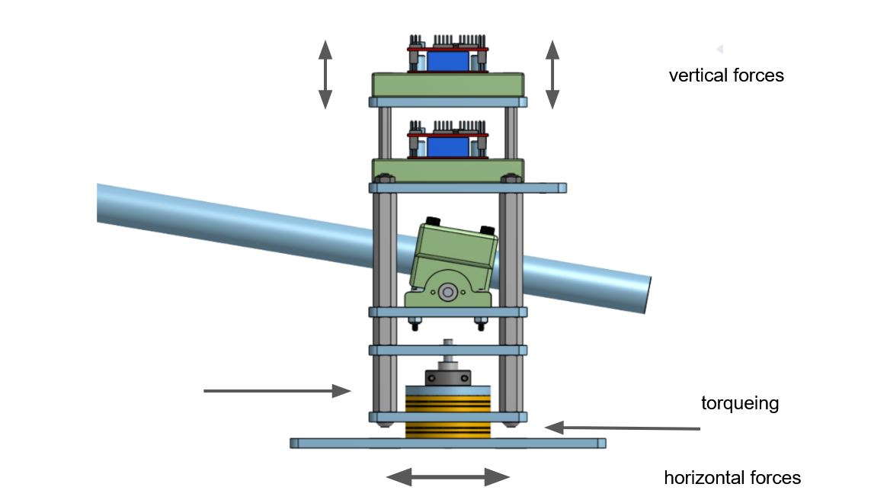
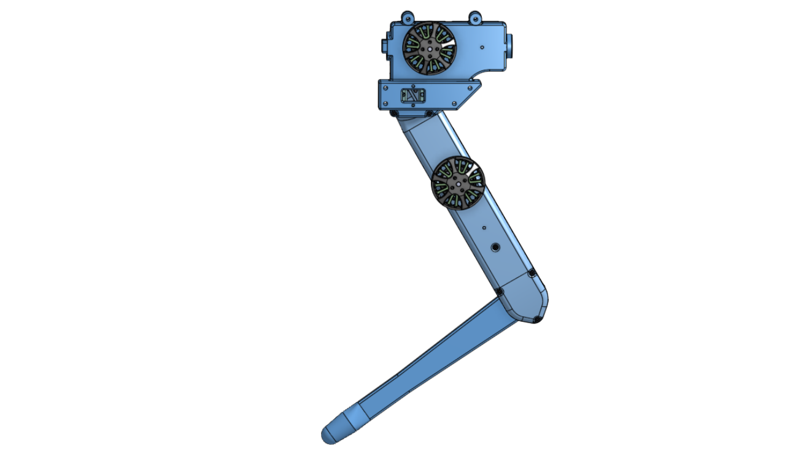

.. _hardware_design:

Hardware
========

Introduction
------------

Having established that a 2D robotic leg constrained by a planarizer device, or a Monopod is the best fit for our
research interests, and that we intend to adapt the open-source Open Dynamic Robot Initiative (ODRI) components for
our robotic leg design, we now describe the design of both the Robotic Leg and the planarizer, or Central Pivot.

Design Requirements
-------------------

As per the original design requirements, the method of constraining the robot
must be inexpensive and easy to manufacture. Other design
requirements unique to the task are as follows:

- It must be able to constrain a 2D robotic leg within a 2D plane.

- It must be able to measure the position of the robotic leg at all positions.

Based on these requirements, there are several possible design patterns which may be suitable for this project: A
treadmill with gantry crane, vertical test stand, or a central pivot.

Possible Design
---------------

Treadmill and Crane
+++++++++++++++++++

A rectangular gantry crane holds up the robotic leg, while a treadmill allows the leg to seemingly move on a moving
surface. While compact, this setup is problematic for several reasons:

- Implementing this setup requires designing a treadmill with active, actuated components, and controlling it to move at
  the same speed that the robotic leg is moving.

- A treadmill design is not that common in research, when compared to a circular planarizer, or a Central Pivot. This
  makes it more difficult to gauge precedents in research.

   ARL-Monopod II standing on a treadmill. :footcite:`ARLMonopodII`

Vertical Test Stand
+++++++++++++++++++

A vertical test stand effectively constrains a 2D Robotic Leg to a single dimension, allowing it to move upwards. A
design for a vertical test stand is already provided by ODRI, as shown here

   2D robotic leg standing on a teststand. :footcite:`grimminger2020open`

However, a vertical test stand overly constrains the robotic leg, and prevents it from exhibiting interesting behavior.
The test stand is only good for measuring the torque applied by the robotic leg actuators, and to attempt simple
jumping behaviors.

Central Pivot
+++++++++++++

A circular planarizer, or Central Pivot, constrains a 2D robotic leg to move along the boundary of a large, horizontal
circle on the ground. To the robotic leg, moving along this large circle approximates being constrained in a straight
line.

This design pattern has a lot of precedent in research, and it is simple and inexpensive to implement. Therefore, we
decided to design an open-source Central Pivot.

   An example of a planarizer used to constrain a small robotic leg. :footcite:`uyanikLegged`

   Another example of a planarizer used to constrain a robotic leg. :footcite:`BuehlerPlanar`

3 major factors complicate the design of the Central Pivot:

- The first is that a Central Pivot only approximates a 2D plane. A robotic leg constrained by a central pivot
  experiences a "radial scrubbing" action, which applies a radial force on the robotic leg whenever it extends or
  compresses. This radial scrubbing action can be minimized by extending the length of the central pivot, and by
  reducing the height of the central pivot.

- The second is that our Central Pivot must accomodate 2 encoders which can measure the horizontal and vertical angle
  of the robotic leg. This restriction rules out simply using a 3D gimbal as the central pivot.

- The Central Pivot design must be able to support both pushing and twisting loads applied to it by a Robotic Leg
  without deformation. Any deformation in the central pivot may result in the encoders losing count of the robotic leg
  position, affecting the observability of the system.

   There must be encoders to measure both vertical and horizontal motion of the Robotic Leg mounted on the planarizer boom.

   "Radial scrubbing" is caused when the robotic leg extends and contracts at the end of a circular planarizer. As shown,
   increasing the length of the planarizer boom reduces the amount of radial scrubbing experienced.

.. figure:: design_images/forces.PNG

   "Radial scrubbing" and the motion of the robotic leg transfers forces down the planarizer boom, causing both vertical and
   horizontal forces on the planarizer, as well as a torque. This torque is minimized by reducing the height of the planarizer.

Central Pivot Design
++++++++++++++++++++

Our open-source design for a Central Pivot can be viewed in a public OnShape document:

   The public OnShape document can be viewed `here <https://cad.onshape.com/documents/13d38c57dee40a129dc0750d/w/a2c92239a21f174507c126a9/e/a6707425b494d93b37562f98?renderMode=0&uiState=62541c5b16304c4d15701151>`_. The "Central Pivot" folder within the OnShape
   document holds all OnShape design files related to the Central Pivot

This design meets the design requirements:

- This Central Pivot design can be constructed completely out of off-shelf electronics, 3D-printed parts, and waterjet-cut
  aluminum plates at a cost of less than CAD$1000.

- It was designed to reduce radial srubbing to a minimum by maximising the radial distance of the
  robotic leg from the center of the central pivot, and by minimising the height of the central pivot.

- It was also verified to be resistant to pushing and twisting loads applied to it. The encoders were measured to have
  a high enough resolution to measure subtle movements of the robotic leg.

   As illustrated, this planarizer design easily accomodates all forces which can be applied on it, while leaving horizontal and
   vertical turning motion unimpeded.

Leg Design
----------

As stated earlier, a 2D robotic leg which can be extended to include additional degrees of freedom is most suitable for
our research interests. The Open Dynamic Robot Initiative provides an open-source robotic actuator which can be adapted
into a 2D robotic leg.

The robotic leg design, adapted from the Open Dynamic Robotic Initiative actuator parts. The public OnShape document can be viewed
`here <https://cad.onshape.com/documents/13d38c57dee40a129dc0750d/w/a2c92239a21f174507c126a9/e/a6707425b494d93b37562f98?renderMode=0&uiState=62541c5b16304c4d15701151>`_ .
The "Robotic Leg" folder within the OnShape document holds all OnShape design files related to the Central Pivot.

Conclusion
----------

Therefore, we have designed an open-source Central Pivot planarizer, and adapted an open-source robotic actuator into a
Robotic Leg, into a Monopod hardware platform which is suitable for our research interests.

  .. footbibliography::
