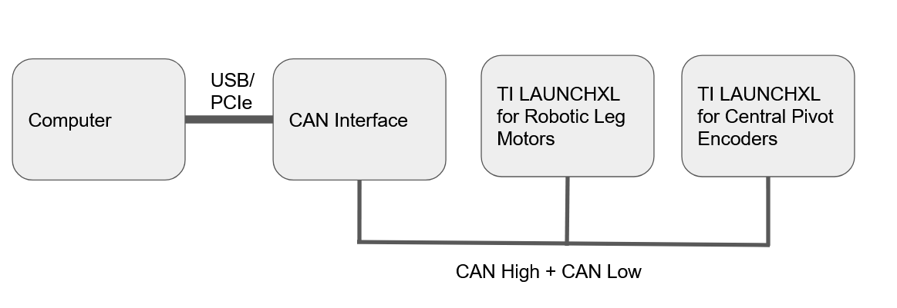

.. _can_connection:

Connecting By CAN
=================

Introduction
------------

Both TI LAUNCHXL microcontroller boards communicate with a computer via CAN protocol. This page provides instructions 
on how to establish CAN communications between the microcontrollers and a computer.

These instructions are derived from ODRI's instructions for establishing CAN communications, which are still worth 
reading. 

- `ODRI Connecting via CAN <https://open-dynamic-robot-initiative.github.io/mw_dual_motor_torque_ctrl/can_connection.html>`_

A comprehensive guide to the CAN protocol can be found here.

- `Vector Learning Module for CAN <https://elearning.vector.com/mod/page/view.php?id=333>`_

Hardware
--------

ODRI recommends using the `PEAK Systems PCAN PCI Express Card <https://www.peak-system.com/PCAN-PCI-Express.206.0.html?&L=1>`_
as a CAN network-to-computer interface. This PCI Express Card allows multiple CAN channels to be handled at the same time,
allowing for future extension. PEAK Systems device drivers are also natively integrated into the Linux operating systems,
so no additional installation steps are required. 

However, the PCAN PCI Express Card has a number of disadvantages. It is quite expensive when compared to other CAN 
interfaces. It also requires access to the computer's PCI Express slots, which is difficult or impossible to do on a
compact laptop.

Our team recommends using the `PEAK Systems CAN to USB <https://www.peak-system.com/PCAN-USB.199.0.html?&L=1>`_ 
as a CAN network-to-computer interface. This allows an easy connection to a laptop computer through a USB port, while 
offering good software support for the Linux operating system. Our team also recommends using the open-source 
`CANable <https://canable.io/>`_ CAN interface device, which is cheaper than the PEAK Systems device, but is more 
difficult to source.

Our team does not recommend using cheap CAN interfaces without proper documentation or support, such as this one 
`CAN to USB adapter <https://www.amazon.ca/USB-CAN-Bus-Converter-Adapter-Cable/dp/B0719LXGYR>`_, for a number of reasons.
These adapters often use ad-hoc text-based protocols which are not supported by standard CAN libraries such as SocketCAN.
A good indicator of whether a CAN interface can be used is found `here <https://python-can.readthedocs.io/en/master/interfaces.html>`_

Before establishing a network connection, ensure that a physical CAN connection is set up as follows. 

   Illustration of CAN connection

Connection Setup(CANable)
-------------------------

If you are using the CANable interface device. Run the following in a Linux terminal to install utilities for SocketCAN,
which is a collection of CAN drivers for Linux.

.. code:: bash

   sudo apt-get install can-utils

If the phyiscal CAN connection has already been set up, check to see where the CAN interface is mounted on your Linux
filesystem:

.. code:: bash

   ls /dev

Search for the pattern **ttyACMX** or **ttyUSBX** (for example, **ttyACM0**). This is where the CAN interface will be 
mounted. Then, run the following to initialize the CAN connection. 

.. code:: bash

   sudo slcand -o -c -s8 /dev/ttyACM0 can0
   sudo ifconfig can0 up
   sudo ifconfig can0 txqueuelen 1000

After that, run the following to check that CAN messages are being sent.

.. code:: bash

   candump can0

If all mechanical, electrical, firmware and software elements have been set up correctly, a dump of all CAN messages 
being sent will be displayed. CTRL-C exits this command.

To terminate a CAN connection, run the following:

.. code:: bash

   sudo ifconfig can0 down

More information about using the CANable device can be found here:

- `CANable Getting Started <https://canable.io/getting-started.html>`_: The CANable interface documentation
- `CANtact Documentation <https://cantact.io/introduction.html>`_: The CANtact interface documentation. The CANtact 
  device is a precursor to the CANable device.

Connection Setup(PEAK Systems Devices)
--------------------------------------

If you are using a PEAK Systems interface device, run the following to install SocketCAN utilities:

.. code:: bash

   sudo apt-get install can-utils

Then, run the following to configure the CAN connection speed to 1Mbit/s, and to initialize the CAN connection:

.. code:: bash

   sudo ip link set can0 type can bitrate 1000000 sample-point 0.867
   sudo ip link set up can0

After that, run the following to check that CAN messages are being sent.

.. code:: bash

   candump can0

More information about using a PEAK Systems device can be found here:

- `ODRI CAN Connection Setup <https://open-dynamic-robot-initiative.github.io/mw_dual_motor_torque_ctrl/can_connection.html#connection-setup>`_

Connection Setup(Python)
------------------------

It is also possible to interface with the CAN interface in Python. To do this, first install the python-can library:

.. code:: bash

   pip install python-can

Instructions and example scripts can be found on the python-can documentation:

- `Python CAN Documentation <https://python-can.readthedocs.io/en/master/index.html>`_

An example script to display encoder positions, velocities and acceleration is found here:

- `Desktop Interactive CAN Controller <https://github.com/OpenSim2Real/desktop-interactive-can-controller>`_

