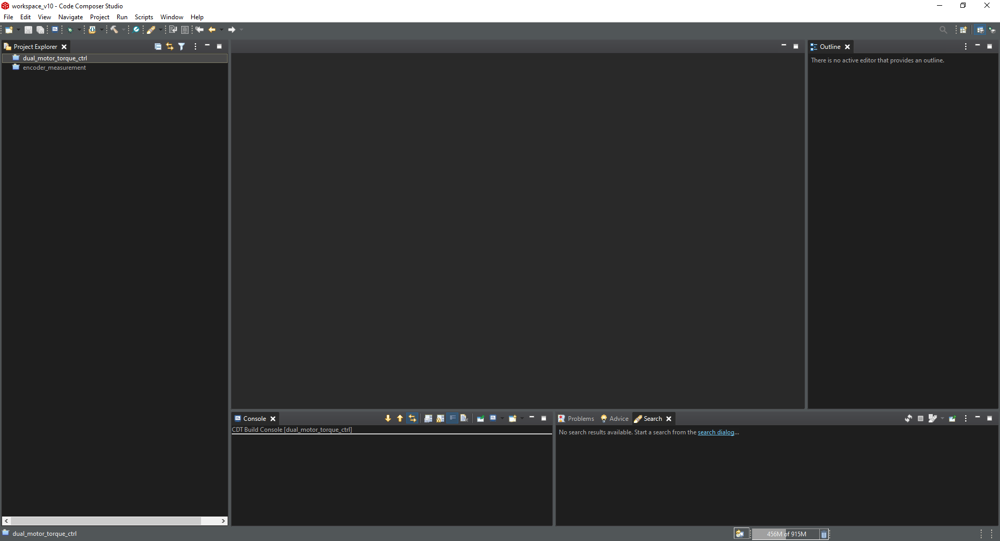
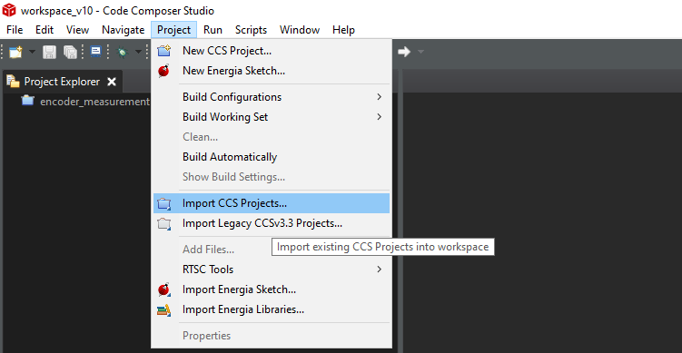
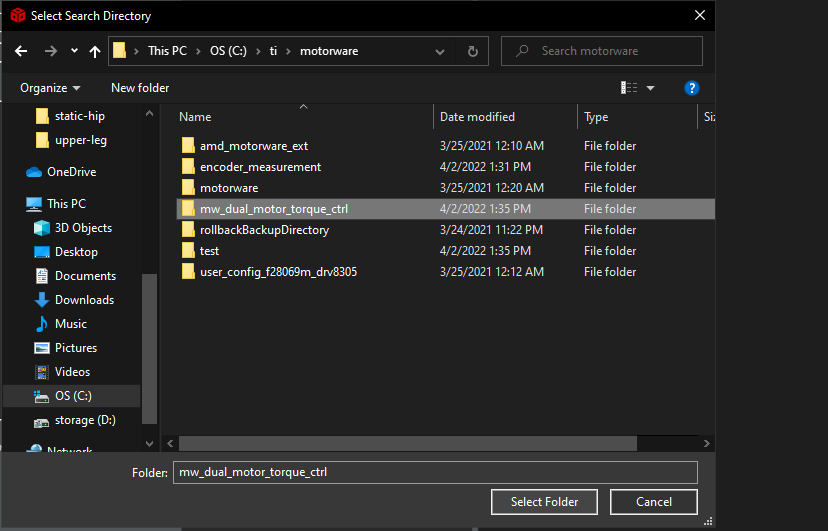
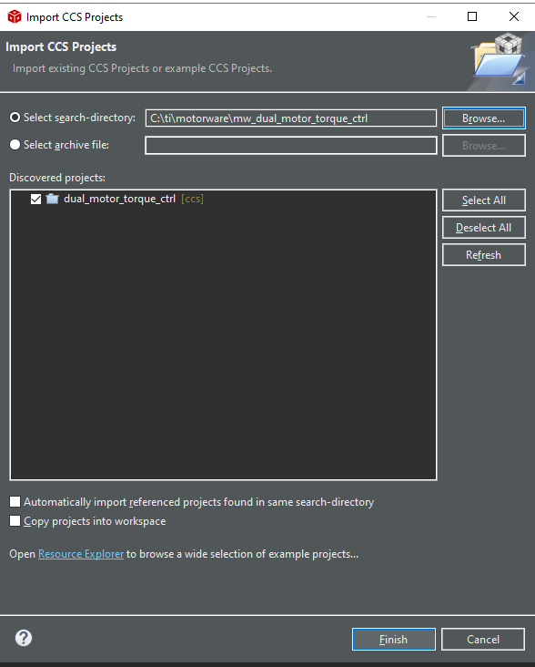
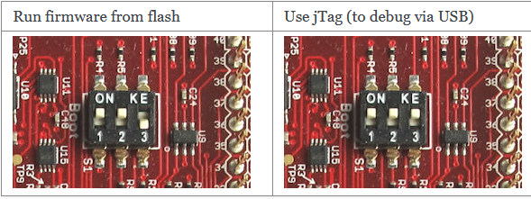

.. _monopod_firmware:

======================
Monopod Firmware Setup
======================

Introduction
=============

This page explains how to flash the prerequisite firmware onto the TI Launchpad boards.

There are 2 different firmware packages which need to be flashed onto 2 TI Launchpad boards.

- The Robotic Leg Firmware controls the motors and reads the encoders on the Robotic Leg.
- The Central Pivot firmware reads the encoders on the Central Pivot.

Communication to and from both TI Launchpads to a computer is done via CAN protocol.

The following instructions require the use of a Windows 10 operating system. The instructions are structured as
follows:

- Setting up TI CCS and Motorware
- Firmware Build Instructions
- Firmware Flash Instructions
- Instructions for Robotic Leg Firmware
- Instructions Central Pivot Firmware
- Further Information

Setting up TI CCS and Motorware
================================

The following instructions were successful on a computer running the Windows 10 operating system.

TI Code Composer Studio(CCS) is an IDE for developing firmware on Texas Instruments microcontrollers, and it provides
the code editor, compiler and flasher required. Download TI Code Composer Studio here:
`TI CCS <https://www.ti.com/tool/CCSTUDIO>`_, and follow the installation instructions. TI CCS is available for both
Windows and Linux operating systems.

TI Motorware is an SDK for developing motor control functionality on Texas Instruments microcontrollers. Download TI
Motorware here `TI Motorware <https://www.ti.com/tool/MOTORWARE>`_, and follow the installation instructions. TI
Motorware is only available for Windows operating systems.

Several repositories from ODRI need to be downloaded:

- `ODRI Motor User Configurations <https://github.com/open-dynamic-robot-initiative/user_config_f28069m_drv8305>`_: This repository contains motor configuration information for the specific type of BLDC motor used.
- `ODRI Motorware Patch <https://github.com/open-dynamic-robot-initiative/amd_motorware_ext>`_: This repository contains a patch to the Motorware firmware.

Finally, the customized firmware repositories used must also be downloaded or cloned:

- `Dual Motor Control Firwmare <https://github.com/OpenSim2Real/mw_dual_motor_torque_ctrl>`_
- `Encoder Measurement Firmware <https://github.com/OpenSim2Real/encoder_measurement>`_

Create a workspace folder. This is where all firmware development will take place.

Structure the workspace directory as follows:

::

  workspace
  ├── amd_motorware_ext
  ├── motorware
  │   ├── docs
  │   ├── eclipse
  │   ├── mw_explorer
  │   └── sw
  ├── mw_dual_motor_torque_ctrl
  ├── encoder_measurement
  ├── user_config_f28069m_drv8305
  └── ...

Finally, apply the motorware patch. Go into the motorware directory, and run the following command.

.. code:: bash

  cd workspace/motorware
  patch -p1 < ../amd_motorware_ext/motorware_patch/motorware_1_01_00_18_patch1

The computer is now set up for firmware development, compilation and flashing.

ODRI provides additional instructions for computer setup. The old version of the instructions, which our own
instructions are based off on, are found here:
`Old Instructions <https://open-dynamic-robot-initiative.github.io/mw_dual_motor_torque_ctrl/build_instructions.html>`_

The new instructions published by ODRI are found here:
`New Instructions <https://open-dynamic-robot-initiative.github.io/udriver_firmware/build_instructions.html>`_

Note that there are minor differences between the instructions provided by ODRI, and the instructions provided below.
For building and flashing firmware, it is recommended to use the OpenSim2Real project as a first resource, and the
ODRI project as a secondary resource.

Firmware Build Instructions
============================

TI Code Composer Studio is used to build the firmware for both motor control on the Robotic Leg, and encoder measurement
on the Central Pivot.

To import a project into your workspace,

   Open TI CCS.

   On the top bar, select the "Project" icon, and in the drop down menu, select the option to "Import CCS Projects".

   A new window will open, and there is an option to browse your filesystem. Navigate to the location of the projects,
   the **mw_dual_motor_torque_ctrl**, or **encoder_measurement**.

   TI CCS will detect that these directories contain a CCS project, and will give you the option to import the project.
   Ensure that CCS does not copy the project into your current workspace. This is because the **mw_dual_motor_torque_ctrl**
   and **encoder_measurement** projects both contain relative directory links to the motorware folders, and arbitrarily
   copying the files to an unknown location will cause these links to break.

Broadly, there are 2 ways to write a program to the microcontroller memory: A RAM build writes the program to the
microcontroller RAM, which is volatile memory. The program will not persist after the microcontroller is depowered.
It is also possible to write the program to the flash memory, in which case the program will persist
after depowering.

To set the build setting such that the firmware is written to either RAM or Flash, follow the following instructions:

1. Right-click the project of interest on the CCS project explorer.
2. On the drop-down menu, select "Build Configurations".
3. It is now possible to set up the build settings to either to a RAM build or a Flash build.

.. figure:: fm_images/build_config.PNG

   Go between RAM builds and Flash builds of the same project. Build configurations can be adjusted by going to the
   "Build Settings" menu.

To build a project from scratch:

.. figure:: fm_images/project_clean.PNG

   First, ensure that there are no residual build artifacts from a previous attempt at building the project. On the
   Project Explorer side bar, right click the current project for a drop-down menu and select the "Clean Project" option.

.. figure:: fm_images/project_build.PNG

   To build the project, right click the current project in the Project Explorer side bar again and select the "Build
   Project option". This will build the project according to the specified build settings.

Further instructions about the use of TI CCS can be found here by selecting the "Help" option on the top-bar of the
TI CCS user interface.

Firmware Programming Instructions
=================================

To program the microcontroller board, first ensure that the microcontroller board is connected to your computer by a
suitable USB cable. If the board is connected, it should show up in the Windows device manager as "XDS100v2", which is
the name of the debug probe integrated directly into the microcontroller board.

TI CCS may require a user to first set up a target configuration, or the settings to connect to a microcontroller board.
To do this, follow these instructions:

.. figure:: fm_images/target_config.PNG

   Navigate to the "View" menu then select Target Configurations".

.. figure:: fm_images/target_config_2.PNG

   Set the target configuration by selecting the appropriate microcontroller. In our case, it is the **TMS320F28069**
   microcontroller. Selecting the "Test Connection" button will open a new window to test the connection to a
   connected microcontroller.

The TI LAUNCHXL microcontroller board has several jumper pins and switches, which must be set correctly for the board
to connect to a computer and to be programmed:

- **JP1** and **JP2** connects the power domain of the microcontroller to the power supplied by USB cable.
  When flashing, keep JP1 and JP2 on.
- **JP6** and **JP7** changes which pins the USB/UART peripherals of the microcontroller are connected to. We kept JP6 and JP7
  both on, disabling the USB/UART peripheral. This is because the firmware we will be running do not need this peripheral.
- **JP3**, **JP4**, **JP5** all do miscellaneous things with the power domain of the microcontroller.
  We kept JP3, JP4 and JP5 all off.

Additionally, there are 3 up-down switches which determine where the microcontroller will boot a program from upon
power-on.

- To allow TI CCS to program the microcontroller, set the switches to S1 = High, S2 = High, S3 = High. This puts the
  boot sequence of the microcontroller under the control of the XDS100v2 debug probe integrated into the microcontroller
  board, allowing for program flashing and debug capabilities.

- To automatically run the program, set the switches to S1 = High, S2 = High, S3 = Low. This sets the microcontroller
  to its default behavior of booting a program from flash memory. Note that the microcontroller is inaccessible to TI
  CCS or the debug probe at this state.

   Boot mode buttons

Once TI CCS has finished its build of the firmware, select the "Run" icon on the top-bar, and in the drop-down menu,
select the "Debug" option. This allows firmware to be stepped through on the microcontroller. Selecting the "Terminate"
button stops this process.

Now, select the "Run" icon on the top-bar of TI CCS again. This time, there should be an option to directly load your
firmware of choice, whether it be the mw_dual_motor_torque_ctrl firmware for the Robotic Leg, or the encoder_measurement
firmware for the Central Pivot. Selecting here loads the program onto the microcontroller.

Instructions for Robotic Leg Firmware
======================================

To flash the firmware for the Robotic Leg,

1. Open the **mw_dual_motor_torque_ctrl** firmware on TI CCS.
2. Clean the project, and do a build, with the build settings set to "Release" mode.
3. Debug the project, as shown above. The debugger can be terminated right after the debugger has finished loading.
4. Flash the project onto the microcontroller, as shown above.

Instructions for Central Pivot Firmware
=======================================

To flash the firmware for the Central Pivot,

1. Open the **encoder_measurement** firmware on TI CCS.
2. Clean the project, and do a build, with the build settings set to "Release" mode.
3. Debug the project, as shown above. The debugger can be terminated right after the debugger has finished loading.
4. Flash the project onto the microcontroller, as shown above.

Further information
====================

Further resources about the microcontrollers and the build system can be found in the
:ref:`Further Reading & Resources <monopod_resources>` page.
