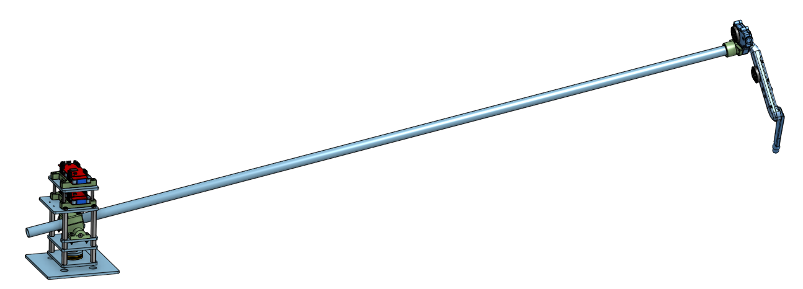

.. _building_the_robot:

Building The Monopod
====================

Introduction
------------

This section describes the process of assembling and testing our hardware platform, called the Monopod.

A major component of the OpenSim2Real project is the development of a physical, hardware platform so that
models running in simulation can be applied to the physical world. The hardware platform, called the Monopod,
has been completely based around prior work by the `Open Dynamic Robot Initiative (ODRI) <https://open-dynamic-robot-initiative.github.io/>`_.

Introduction to Assembly/Testing Process
----------------------------------------

Construction of the Monopod can be roughly split into 2 distinct parts: The Robotic Leg and the Central Pivot.

The Robotic Leg is based on a design provided by ORDI. It is a single leg with 2 actuated degrees of freedom,
allowing jointed motion within a 2D plane. Actuation of the robotic leg is done with 2 BLDC motors with a large
gear reduction, and measurement is done with 2 encoders.

.. figure:: leg_images/leg.png

The Central Pivot is a structure to constrain the motion of the Robotic Leg to be approximately planar.
This allows the Robotic Leg to move freely within a 2-dimensional plane without falling on its side
without requiring bulky supports, gantry cranes or treadmills.

.. figure:: cp_images/cp.png

The Robotic Leg and the Central Pivot can then be tested separately, before being combined into the completed
Monopod. The completed Monopod can then be tested as a whole before models are run on it.

Assembly/Testing Instructions
-----------------------------

This guide will comprise a walkthrough of the entire Monopod assembly process from procurement of parts,
to assembly and testing. Reading this entire guide from beginning to end is recommended before starting
construction.

This guide comprises of the following sections in order:

- :ref:`Build Requirements <build_requirements>`: A list of mechanical, electrical and software skills
  to construct and run basic tests on the Monopod, with a list of required tools.
- :ref:`Bill of Materials <bom>`: Bill of materials for the entire Monopod hardware platform.
- :ref:`Firmware Setup <monopod_firmware>`: Instructions on how to flash and run the motor control 
  microcontroller firmware.
- :ref:`Robotic Leg Build Instructions <build_instructions_leg>`: Comprehensive assembly instructions for
  the Robotic Leg.
- :ref:`Robotic Leg Testing Procedure <basic_tests_leg>`: Basic testing procedures for the Robotic Leg
- :ref:`Central Pivot Build Instructions <build_instructions_pivot>`: Comprehensive assembly instructions 
  for the Central Pivot.
- :ref:`Central Pivot Testing Procedure <basic_tests_pivot>`: Basic testing procedures for the Central Pivot
- :ref:`Central Pivot - Robotic Leg Integration <leg_pivot_integration`: Instructions on integrating the 
  Central Pivot and Robotic Leg builds.
- :ref:`Hardware Integration Testing<leg_pivot_integration_testing>`: Basic tests to run on the completed Monopod.
- :ref:`Further Reading & Resources <monopod_resources>`: Further readings and relevant resources to aid 
  the assembly procedure.

.. toctree::
  :hidden:
  :caption: Building The Monopod

  build_requirements
  bom
  monopod_firmware
  build_instructions_leg
  basic_tests_leg
  build_instructions_pivot
  basic_tests_pivot
  leg_pivot_integration
  leg_pivot_integration_testing
  monopod_resources
