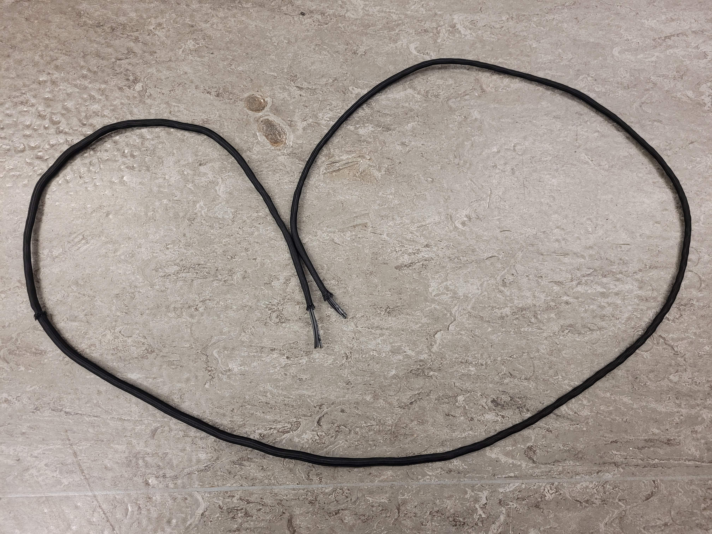
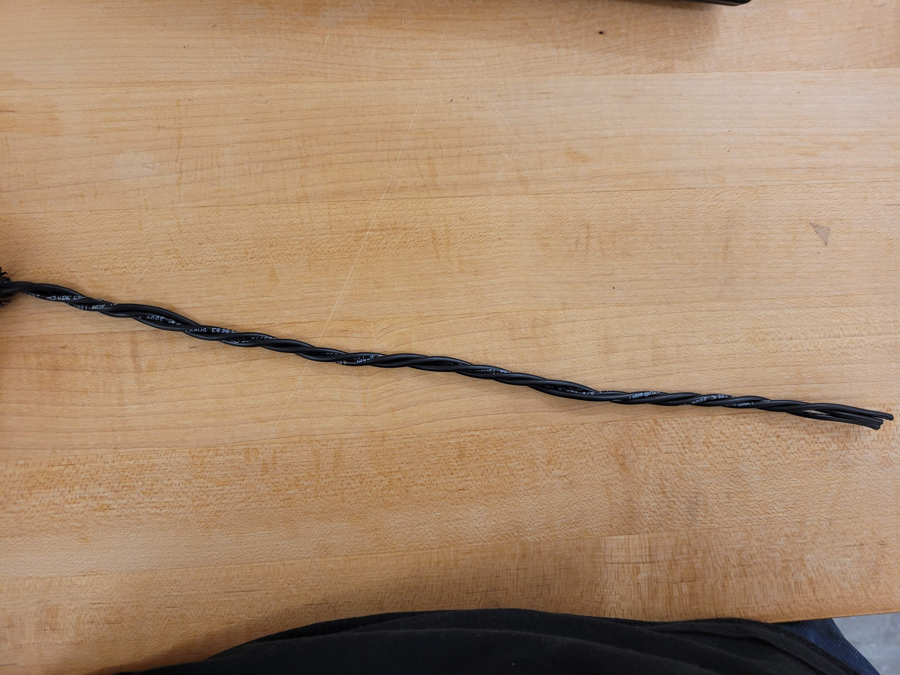
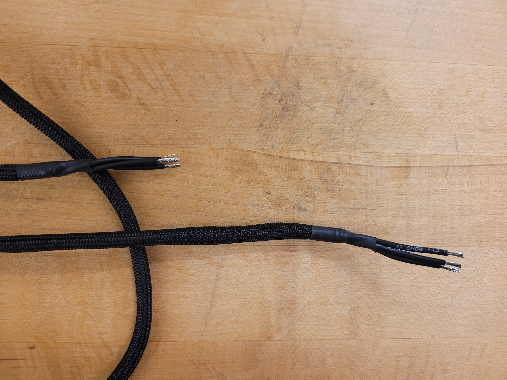
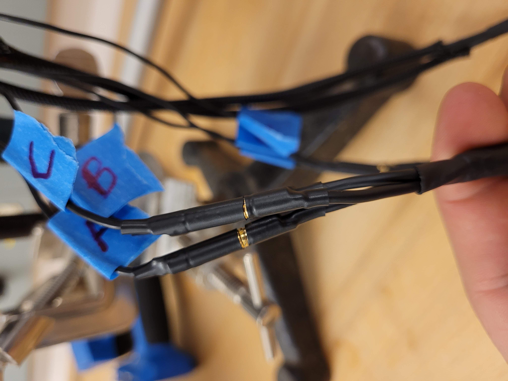
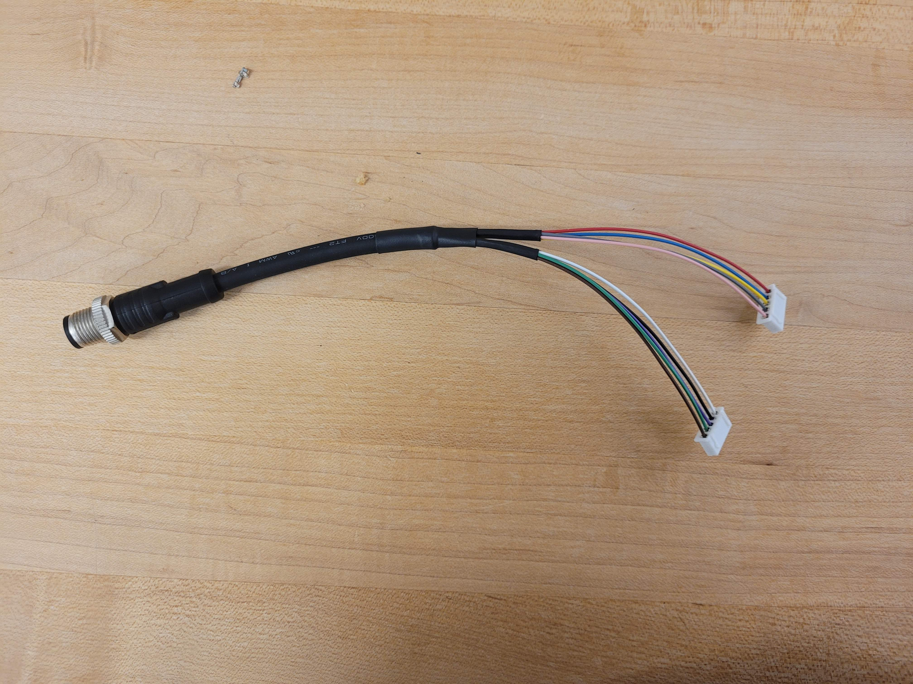
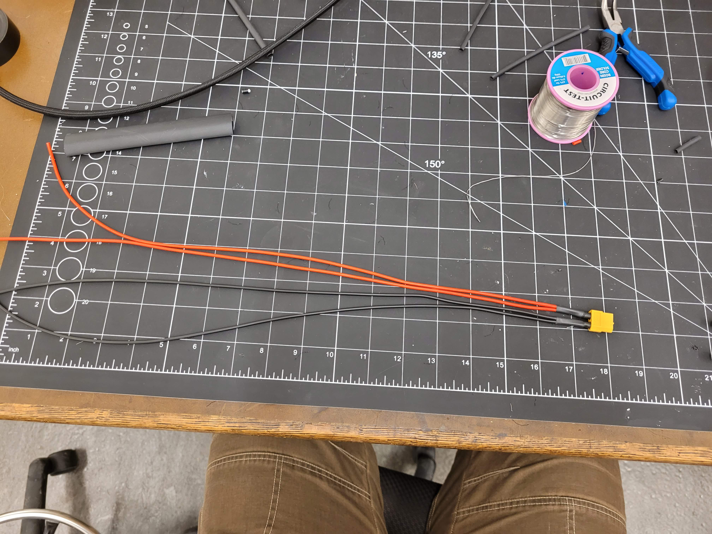
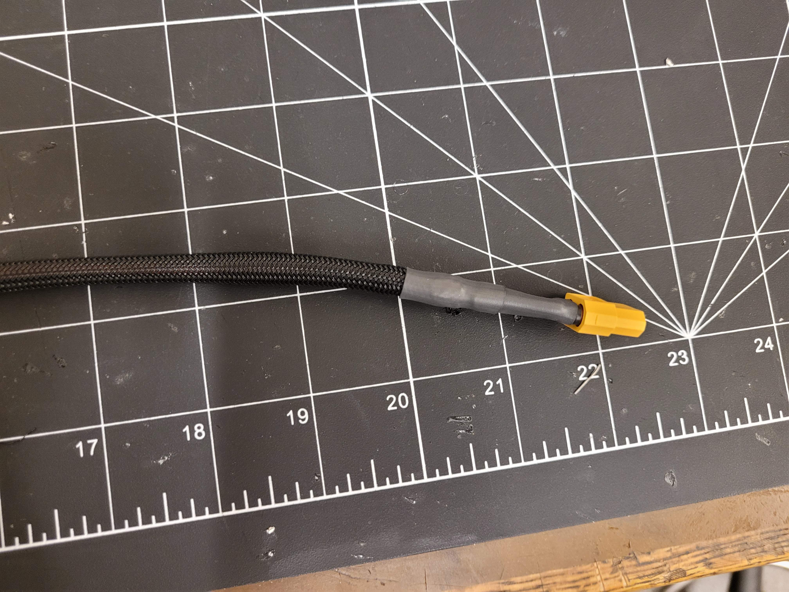
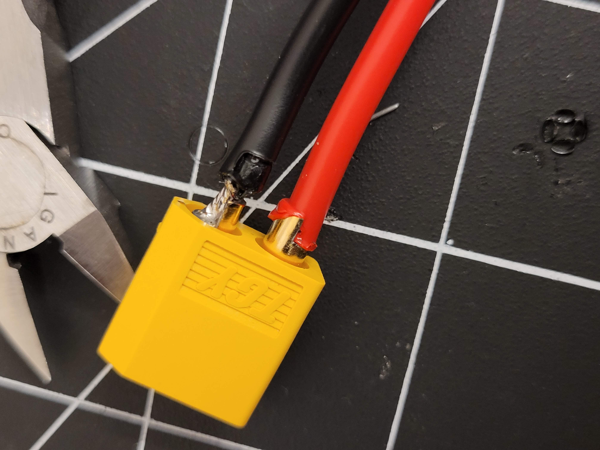
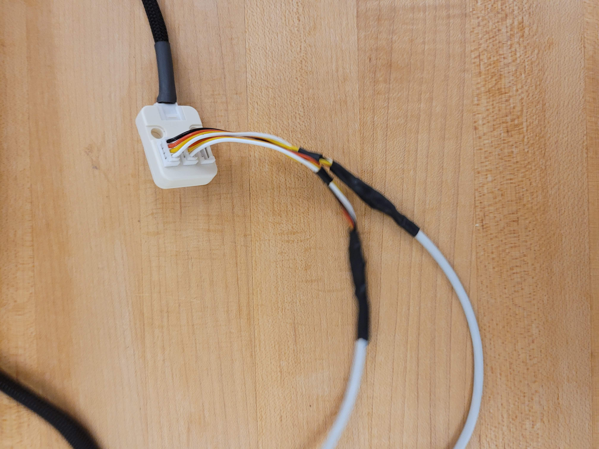
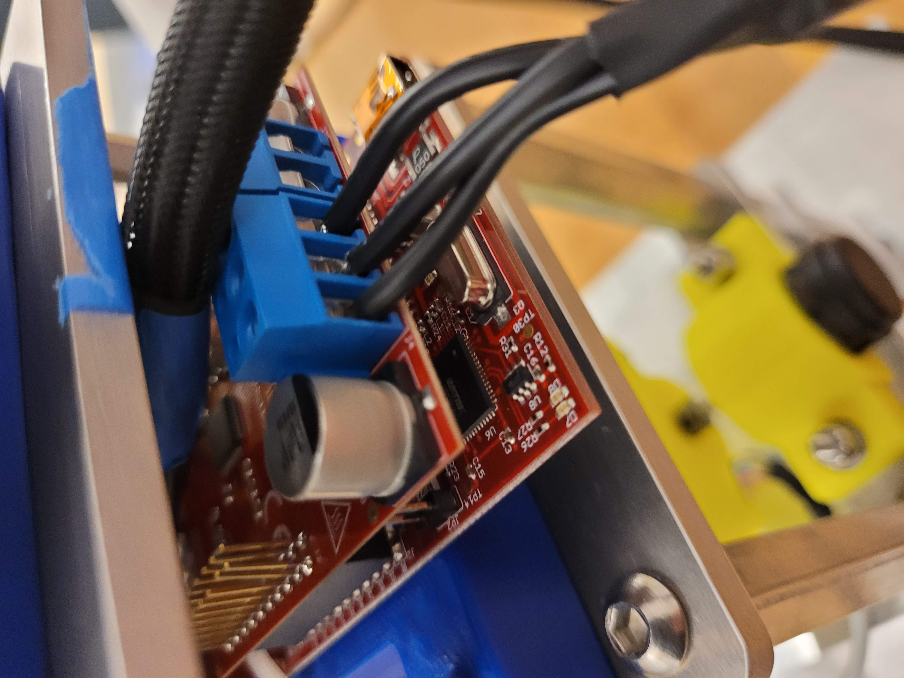

.. _leg_pivot_integration:

Central Pivot - Robotic Leg Integration
=======================================

Introduction
------------

After the Central Pivot and Robotic Leg subassemblies have been assembled and tested, integration of the
Central Pivot with the Robotic Leg to become the full Monopod. This section provides
instructions on how this may be done.

Motor Cable Preparation
-----------------------

Consumables for this step:

- 1pc, spool of flexible black wire
- 6pc, male gold-tinned 2mm connectors
- 1pc, spool of expandable plastic sleeving

Instructions:

1. Cut 6 2.5m long lengths of black wire,
2. Using a drill or otherwise, twist the black wire together into 2 bundles of 3 wires.
3. Slowly, inch the expandable plastic sleeving through the bundles of 3 wires until the plastic sleeving covers the
   entire bundle. Cut the expandable plastic sleeving at the end.
4. Strip 10cm off the expandable plastic sleeving at both ends of the bundles, so that there is a 10cm length of
   exposed black wire at both ends of the bundles. Use heat shrink tubing to seal both ends of the plastic sleeving
   around the wire bundles.
5. On one end of each bundle, solder on the male gold-tinned connectors. This will be the end of the wire bundle
   connecting to the Robotic Leg. Insulate by applying heat-shrink tubing around the connectors.
6. With some solder, tin the wires on the other end of each bundle. This is the end that will be connected to
   TI BOOSTXL motor driver boards on the Central Pivot, which are in turn connected to a TI Launchpad development board.
7. Identify which wires in the bundle correspond to which wires on the start and end, with a multimeter. Label the
   motor phases as A, B, and C.

.. figure:: in_images/3phase_1.jpg
.. figure:: in_images/3phase_2.jpg

.. figure:: in_images/3phase_6.jpg

.. figure:: in_images/3phase_8.jpg

Products for this step:

- 2pc, 2m lengths of 3-wire bundles of black cable, covered in plastic sleeving, to transmit 3-phase motor current from
  the TI BOOSTXL boards on the Central Pivot to the Robotic Leg.

Encoder Cable Preparation
-------------------------

Consumables for this step:

- 1pc, 6' long female-female cable with 10-pins
- 1pc, 1' long male-male cable with 10-pins
- 2pc, 5-pin plastic JST connectors
- 10pc, JST crimp sockets

Instructions:

1. Cut the 1' long male-male connector into 2 equal halves.
2. Screw the halves onto both ends of the long female-female connector.
3. Strip off some insulation on both ends, exposing 10 wires on each end.
4. Strip off some insulation off all the wires on both ends.
5. On both ends, group the 10 wires into 2 groups of 5 wires. Take note of this grouping.
6. On one end, crimp all 10 wires with the 10 JST sockets, and insert them into 2, 5-pin JST connectors. This is the
   end that will connect the encoders to the TI LAUNCHXL boards on the Central Pivot. Take note of which wire color is
   associated with which pin position and encoder peripheral on the TI board.
7. On the other end, group the 10 wires into the encoder groupings from the TI board end. Use heat shrink to physically
   split the 2 groups of wires.

.. figure:: in_images/mm.jpg
.. figure:: in_images/mm_cut.jpg

.. figure:: in_images/encoderwire_1.jpg
.. figure:: in_images/encoderwire_2.jpg

.. figure:: in_images/encoderwire_4.jpg

Products for this step:

- 1pc, long cable with 10 exposed wires on both ends, to transmit encoder signals from the Robotic Leg, across the long
  horizontal boom, into the TI LAUNCHXL board at the Central Pivot.

Connections to the Robotic Leg
------------------------------

Consumables for this step:

- 1pc, Robotic Leg from previous assembly processes.
- 6pc, female gold-tinned 2mm connectors
- 1pc, encoder cable from previous assembly processes.
- 2pc, long motor phase cable from previous assembly processes.
- 1pc, spool of expandable plastic sleeving.

Instructions to connect encoder wires:

1. Take note of which encoder wires are attached to which pin on which encoder in the Robotic Leg.
2. Solder the encoder wires to the long encoder cable, paying attention to where each encoder wire should be connected.
   Apply heat shrink on exposed cable for strain relief, and cover the encoder cables outside the encoder wires with
   expandable plastic sleeving for additional protection.

TODO: An image of the connected encoder wires

Instructions to connect motor phase wires:

1. If the motor phases for each motor are known, label the motor phase wires and the motor number
2. Solder on female gold-tinned connectors onto the motor phase wires coming out of the Robotic Leg. Cover the exposed
   connectors with heat shrink tubing for insulation, and also cover the motor phase wires coming out of the robotic Leg
   with expandable plastic sleeving for additional protection.
3. Connect the Robotic Leg motor phase wires with the long motor phase cables.

.. figure:: in_images/wiring_1.jpg
.. figure:: in_images/wiring_2.jpg

Products for this step:

- 1pc, Robotic Leg with extended motor phase and encoder cables.

Robotic Leg - Central Pivot Connection
--------------------------------------

Consumables for this step:

- 1pc, Robotic Leg from previous assembly processes.
- 1pc, Central Pivot from previous assembly processes.
- 1pc, TI LAUNCHXL board with 2 TI BOOSTXL boards connected.

Instructions:

1. Push the lengthened motor phase wires and encoder cable through the long boom such that it emerges on the other end.
2. Strain relief the connectors on the Central Pivot side.
3. Connect the motor phase wires and encoder wires to their correct locations on the TI LAUNCHXL and TI BOOSTXL
   boards, using the labels found earlier.
4. Connect the Robotic Leg to the adapter piece and secure it with bolts and locknuts. Ensure that all of the wires
   emerging from the Robotic Leg are threaded through the boom.
5. Secure the TI boards onto a 3D-printed mount on the Central Pivot.

Products for this step:

- 1pc, Monopod assembly without power connections or CAN connection

Final Connections
-----------------

Consumables for this step:

- 1pc, Monopod assembly without power connections or CAN connection

Instructions to power the Robotic Leg:

1. The TI LAUNCHXL board with the BOOSTXL boards connected to the Robotic Leg can be powered by applying 24V across
   the power terminals on the BOOSTXL boards, using a power supply. To do this, solder together 2 'Y-shaped' cables
   from thick cable. On one end, solder on connector terminals to a power supply. On the 'Y-shaped' end, tin the ends
   with solder for better insertion into the screw terminals on the BOOSTXL boards.

Instructions to power the Central Pivot:

1. The TI LAUNCHXL board with the Central Pivot encoders attached can be powered by applying 3.3V across the 3.3V and
   Ground pins on the TI LAUNCHXL board. This can be done by connecting the 3.3V pins of both TI LAUNCHXL boards
   together, and the Ground pins of both TI LAUNCHXL boards together, with individual wires.

.. figure:: in_images/power_11.jpg
.. figure:: in_images/power_12.jpg

.. figure:: in_images/power_2.jpg
.. figure:: in_images/power_3.jpg
.. figure:: in_images/power_4.jpg

.. figure:: in_images/power_6.jpg
.. figure:: in_images/power_7.jpg
.. figure:: in_images/power_8.jpg
.. figure:: in_images/power_9.jpg
.. figure:: in_images/power_1.jpg

Instructions to connect TI LAUNCXL boards to CAN:

1. The TI LAUNCHXL boards have header pins for CAN. A Y-shaped connector between the TI LAUNCHXL boards, and a
   CAN-to-USB device can be made with 3-pin cabling.
2. The CAN-to-USB device is then connected to a computer, completing the setup of the Monopod.

.. figure:: in_images/can1.jpg

.. figure:: in_images/can3.jpg

Products for this step:

- 1pc, Monopod assembly with power and CAN connections.

.. figure:: in_images/conn1.jpg
.. figure:: in_images/conn2.jpg

.. figure:: in_images/conn4.jpg
.. figure:: in_images/conn5.jpg
