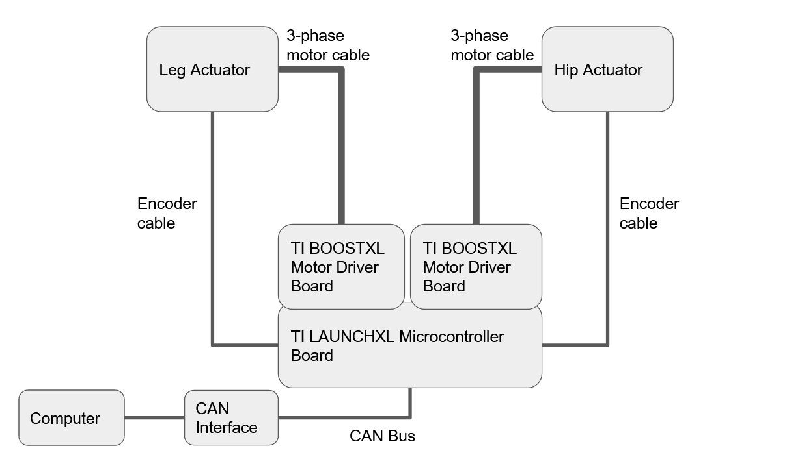
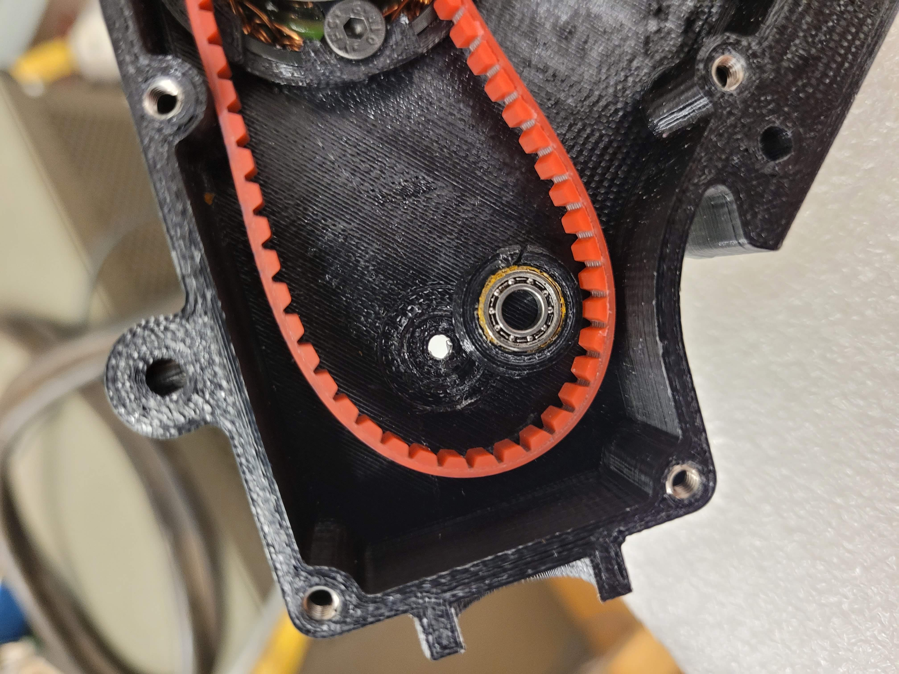
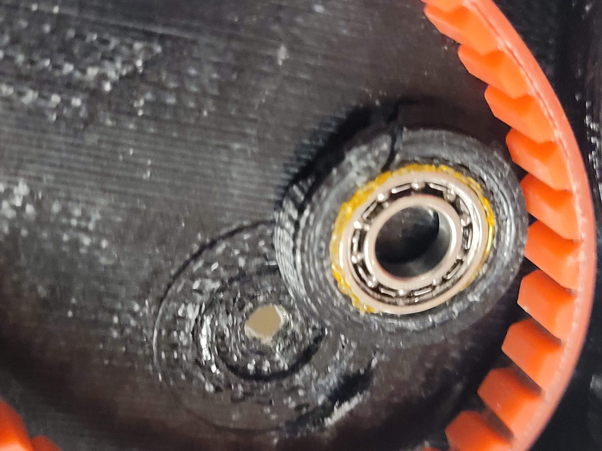
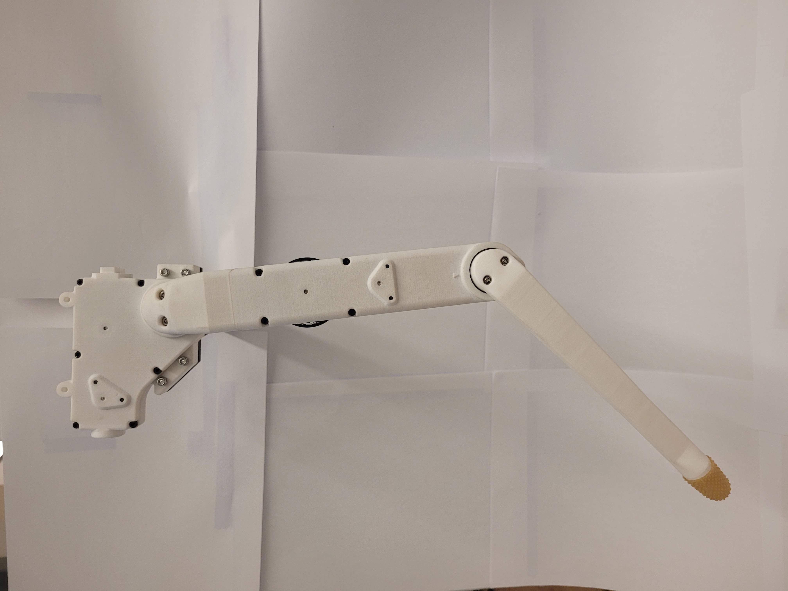

.. _basic_tests_leg:

===========
Leg Testing
===========

Introduction
============

Once the robotic leg has been assembled, there are several tests that can be run to ensure that the Robotic Leg
was assembled correctly, and that no parts were damaged during assembly.

Mechanical Checks
=================

There are several checks to confirm that each modular actuator has been assembled correctly:

- Turning the motor should produce a smooth motion in the output pulley, with little to no noise or friction.
  See the Troubleshooting section if unusual noises are observed, or if the friction is high.

- Motor and encoder wires should not move when the motor is turned, as motor and encoder wires should not be
  touching any moving parts.

- The set screws that connect the motor rotor to the motor shaft should be re-inserted.

- Motors rotor should have no contact with the motor stator. Check this by slowly turning the rotor, and observing if
  there is any contact with the stator due to metallic debris. See the Troubleshooting section if contact is observed.

- Actuator shells should have little to no gaps in between them.

- All bolts between the actuator shells should be tightened.

Running the Motors
===================

Once it is verified that each actuator is mechanically sound, the actuators can be individually tested by freely running
the motors. This tests that the BLDC motors and the encoders have been correctly installed, and are not damaged.

First, set up a CAN connection to the Robotic Leg microcontroller board as instructed in :ref:`CAN Connection <can_connection>`.
This requires temporarily connecting the encoder wires and motor cables from the Robotic Leg to the microcontroller board.

   Illustration on how to connect motor and encoder cables, as well as how to set up the CAN connection

.. important::

   Ensure that the Robotic Leg actuators are not connected to each other mechanically or electrically, so that both actuators can
   spin freely without hardware collision or wire entanglement.

After a CAN connection has been set up between the microcontroller board and a computer, run the following command to verify that
a CAN connection has been established:

.. code:: bash

   candump can0

If 0x010 messages are being received every second, the CAN connection has been successfully established. Run the following commands
in another terminal window, while keeping the CAN dump in the first window running, to enable both motors on the Robotic Leg.

.. code:: bash

   cansend can0 005#0000000000000000  # set target current to zero
   cansend can0 000#000000000000001E  # disable CAN receive timeout
   cansend can0 000#0000000100000001  # enable the system
   cansend can0 000#0000000100000014  # enable sending measurements
   cansend can0 000#0000000100000002  # enable motor 1
   cansend can0 000#0000000100000003  # enable motor 2

If this step is successful, both motors should jitter slightly, and CAN messages with ID 0x20, 0x30, 0x40, and 0x70 should appear
in the CAN dump.

To apply torque to both motors, run the following:

.. code:: bash

   cansend can0 005#0000000100000001  # set target current for both motors to a small value

Applying increasingly larger torques should cause both motors to spin slowly. To stop the motors from spinning, simply set the
target currents to zero.

.. code:: bash

   cansend can0 005#0000000000000000  # set target current to zero

Troubleshooting
===============

If unusual noises are observed when spinning an actuator, there are several possible causes:

- Check if there is magnetic debris between each motor stator and rotor. Any magnetic debris can be removed by
  disassembling the actuator and removing the motor, removing debris from the stator and rotor with strong
  adhesive tape, and reassembling the motor.

- Check if the source of the noise is from the bearings. If open bearings are used, debris can enter the space
  between the ball bearings, causing noise and friction. This problem can be avoided by using closed bearings.

- Check if the encoder codewheel is scraping against the encoder electronics. This problem indicates that the encoder
  disc is either running too low or too high on the motor shaft, or that the encoder disc is not perfectly
  horizontal on the encoder disc holder. Careful reassembly of this subcomponent is required.

- Check if there is any plastic or metal debris within the actuator shells. These can be removed with adhesive
  tape, or with a small vacuum.

.. figure:: leg_images/motor_spacing.jpg

   There should be no debris between the motor stator and rotor.

If the friction felt at the output pulley is anomalously high, there are several possible causes:

- The timing belts might be on too tight. The tension in the timing belts may be increased or decreased by using
  different diameters of timing belt rollers.

- Damage to the bearings from excessive force, or debris in the bearings, may add friction to the output pulley.
  This can be checked by turning each bearing individually to inspect for anomalous friction.

- The encoder codewheel might be scraping agianst the encoder electronics. Check that the encoder disc does not
  touch the encoder electronics.

Encoder disk safety
===================

Handling the encoder disk is a delicate process which might permanently scratch the disk if not done properly. A
scratched encoder disk will cause an incorrect position to be read, resulting in control problems.
Special precautions must be taken to reduce the risk of this happening:

- Cover the lines of the encoder disk with tape whenever the encoder disk must be moved.

- Always lay the encoder disk on a flat, clean surface whenever it must be put aside.

- Clean the encoder disk with adhesive tape, or a fine brush.

- Relay all handling precautions taken to the relevant machine shop technicians.

.. figure:: leg_images/encoder_care_2.jpg

   Before handling the encoder disk for any purpose, wrap the encoder disk in tape.

.. figure:: in_images/damage_3.jpg

   Incorrect handling of the encoder disk may result in the encoder disk being scratched, which may cause control
   problems later on.

Known failure modes
===================

Under high torques, and if the 3D printed shell is printed with inferior materials, some of the bearing holders in the
actuator shell might crack, damaging the shell.

   Bearing holder for one of the timing belt pulleys is sheared off. The material used here was PLA plastic with an
   FDM printer, which is unsuited for this application.

   Another view of the bearing holders for a timing belt pulley being sheared off.

This problem can be avoided by limiting the torque applied to the actuators, and using better 3D printed materials.
We found Nylon 12 material printed on an SLS printer to be better for this application.

Conclusion
==========

After the tests on each individual actuator module have passed, connect the actuator modules together to the full
Robotic Leg.

