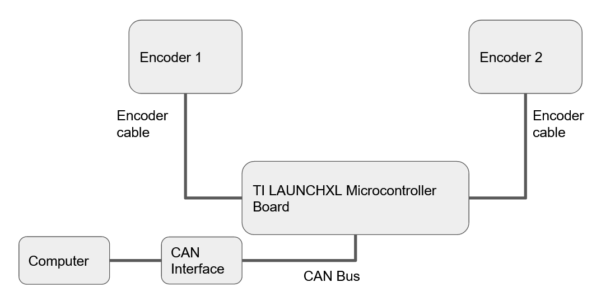

.. _basic_tests_pivot:

Central Pivot Testing Procedure
===============================

Introduction
------------

Once the Central Pivot has been assembled, several basic tests can be run to ensure that the mechanical and
electrical assembly, as well as the flashing of the firmware onto the microcontroller boards, have been done
correctly.

Firstly, place the Central Pivot on a flat surface, and ensure that there is room to move the long horizontal
boom around. Rubber feet can be placed on the base of the Central Pivot for stability. Alternatively, the Central Pivot
can be fastened to the ground.

In addition, ensure that the encoders on the Central Pivot are connected to a TI LAUNCHXL board, and ensure
that the LAUNCHXL board is connected to a power supply. Ensure that the header pins on the LAUNCHXL boards are not
touching each other, or an external metal surface.

Basic Mechanical Tests
----------------------

There are several mechanical checks to test that the Central Pivot has been assembled correctly:

- Move the long horizontal boom side-to-side and up-to-down around the Central Pivot. There should be little to no
  friction in either direction.

- Try to twist the long horizontal boom around its long axis. There should be sufficient holding force between the
  upper and lower boom holder 3D-printed pieces to prevent any rotation.

- Holding the non-rotating base of the Central Pivot to the ground, attempt to shake the rotating portion of the
  Central Pivot side-to-side. As the 2 thrust bearings at the base of the Pivot are held tightly together by a wave
  spring and a shaft collar, there should be little to no play.

- Using a thin marker, mark the 6mm horizontal shaft on the Pivot and the lower 3D printed boom holder at the same
  place. Move the horizontal boom up and down vigorously - the boom holder should not slip relative to the 6mm shaft,
  because they should have been tightly epoxied together.

- Grip the long horizontal boom tightly, and attempt to rotate the 3D printed adapter piece at the end of the boom.
  As the 3D printed adapter piece has been epoxied onto the boom, there should be no rotation.

- Attempt to twist the horizontal aluminum plates relative to each other. If the standoffs connecting the aluminum
  pieces are secured tightly, the Central Pivot should not twist.

- Pull on the encoder connectors to ensure that the connectors were done correctly. 

If these tests produce adequate results, then the mechanical assembly of the Central Pivot is likely to be correct.

Basic Electrical Tests
----------------------

To test that the encoders on the Central Pivot are functional:

- Connect the 5V Power and Ground of each encoder to a power supply, and connect the A and B Phase of the encoders to
  an oscilloscope. Rotating the Central Pivot should now show encoder pulses on the oscilloscope.

Reading Encoder Measurements
----------------------------

Once it is verified that the Central Pivot is mechanically sound, the encoders can be tested to ensure that they are
providing correct position, velocity and accelerations.

First, set up a CAN connection to the Central Pivot microcontroller board as instructed in :ref:`CAN Connection <can_connection>`.
This requires temporarily connecting the encoder wires on the Central Pivot to a microcontroller board, and connecting 
the microcontroller board to a computer via CAN.

   Illustration on how to set up temporary encoder and CAN connections

To test that the encoder measurement firmware is running, and that a CAN connection between the TI LAUNCHXL board has
been established, Run the following to check the encoder position messages sent by the TI LAUNCHXL board.

.. code:: bash

    candump -t d can0,041:FFF

Moving the horizontal boom on the Central Pivot should now produce a change in the position values being sent. These
values are in bytes and are not decoded yet. To decode them into actual position values, the following script has been
provided: `Desktop Interactive Can Controller <https://github.com/OpenSim2Real/desktop-interactive-can-controller>`_

After configuring the appropriate port numbers in the script, the code should read out the encoder positions of the
Central Pivot. A good check here is to check that the encoder code wheels are firmly attached to their shafts, and
are not slipping:

1. Put the horizontal boom at an initial position, and reset the TI LAUNCHXL board by pressing the small pushbutton on
   it. Mark this initial position.
2. Run the script, and ensure that the position values displayed are very close to zero.
3. Move the horizontal boom vigorously, and put it back down at the initial position.
4. Ensure that the position values displayed by the script are very close to zero.

If the result of the above tests are adequate, then the Central Pivot should be ready for operation.
