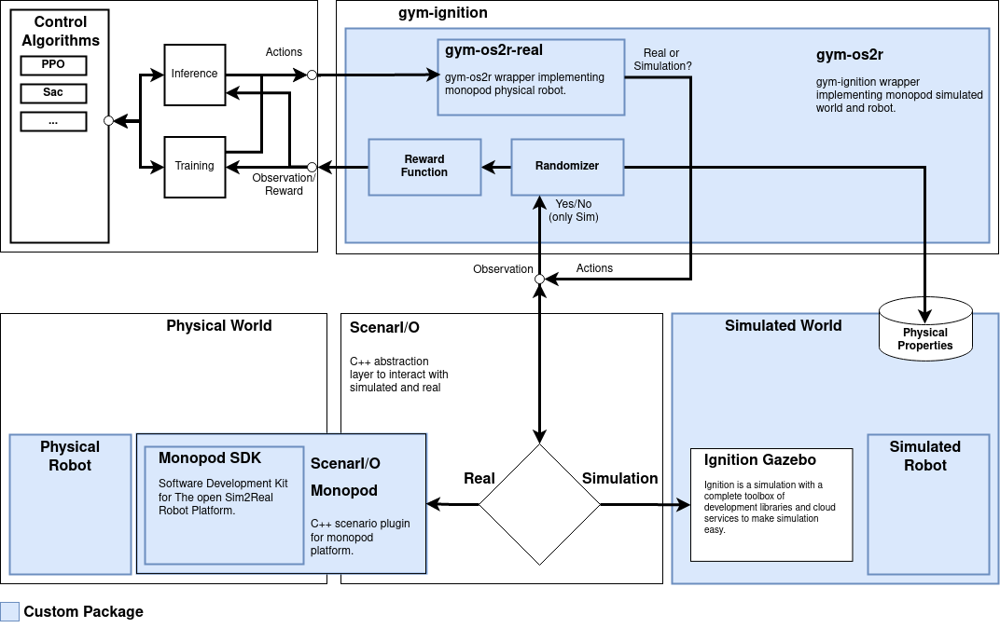

.. _software:

Software
========

   System-level diagram, illustrates the flow of information through different
   software components and  between environment (Real or Simulated) and model.
   All the packages built by our team are highlighted in blue.

The system level diagram does a good job at summarizing the different packages of this project.
Summary of purpose of each package:

1. ``Monopod SDK``: Implements drivers for the physical robot, accompanied by an API to control the
   monopod and/or receive measurements from the robot. Additionally, Monopod SDK implements safety
   limits that run independently in a separate thread.

2. ``ScenarI/O``: Abstract layer that is used to interface with robots :footcite:`gym_ignition`
   by exposing APIs to interact with a scene. The scene is defined as a World object that can
   return Model objects. This allows the simulated or physical robot to be implemented as a
   separate scenarIO back-end, which can be switched between.

3. ``gym-os2r``: Implements the monopod gym environments using the ``gym_ignition`` environment structure
   (separates simulator interface from task logic). It is shipped alongside ``gym_os2r_real``
   which all features that require additional dependencies required to run
   ``gym_os2r`` on the physical robot.

The following design requirements drove the design of the software platform:

1. High-level code should interact with an abstracted representation of the robot
   to hide implementation details between the simulator or real robot.

2. Must maintain strict real-time scheduling of 1khz during model inference.
   This require becomes more problematic if training on the real robot.

3. Implement simple, easy to use drivers for the physical robot.

4. Separate physical robot and simulator dependencies to simplify installation.

5. Provide simple method to install and setup workspace.

A basic root introduction on how to use the software stack to control the robot can be
found in the :ref:`quick_start_physical`, :ref:`how_to_physical`, or :ref:`tutorials_physical` sections.

.. _os2r-superbuild-structure:

Dependency Structure
--------------------

Illustrating the project dependencies in a directed graph we see the complexity of
the directed dependency graph.

..
  Comment of resources for graphviz
  https://www.sphinx-doc.org/en/master/usage/extensions/graphviz.html
  https://pypi.org/project/btd.sphinx.graphviz/

.. graphviz:: superbuild/os2r-superbuild.dot

A common method to handle projects with multi-layer dependencies is to use a dependency
manager, if you are familiar with ROS, this would be `catkin`_ or `colcon
workspace`_. However, this adds in additional project dependencies and
limits the flexibility of the build system.

.. note::

   We plan to eventually package the physical robot dependencies within a container to make this process
   as streamline as possible. For more information please look at the :ref:`roadmap`.

Superbuild
----------

One of the design requires was to provide a "simple, easy method to install and setup
workspace". To do this we created a custom build system based on the superbuild CMake
pattern using pure CMake for portability reasons and for customizing the build via
CMake options.

This was done using a meta repository (so-called "superbuild") that uses `CMake`_
and `YCM`_ to automatically download and compile software developed in
the OpenSim2Real GitHub organization. This superbuild is based on the
`robotology-superbuild`_. A `YCM Superbuild`_ is a CMake project
whose only goal is to download and build several other projects.

`CMake`_ is an open-source, cross-platform family of tools designed to
build, test and package software.

.. _CMake: https://cmake.org/
.. _YCM: https://github.com/robotology/ycm
.. _robotology-superbuild: https://github.com/robotology/robotology-superbuild
.. _YCM Superbuild: http://robotology.github.io/ycm/gh-pages/git-master/index.html#superbuild
.. _catkin: http://wiki.ros.org/catkin/workspaces
.. _colcon workspace: https://colcon.readthedocs.io/en/released/user/quick-start.html

..
  Comment. Index exists below this point

.. toctree::
  :caption: Software

  superbuild/superbuild_installation
  monopod_sdk/monopod_sdk
  scenario_monopod/scenario_monopod
  gym_os2r/gym_os2r
  gym_os2r_real/gym_os2r_real
