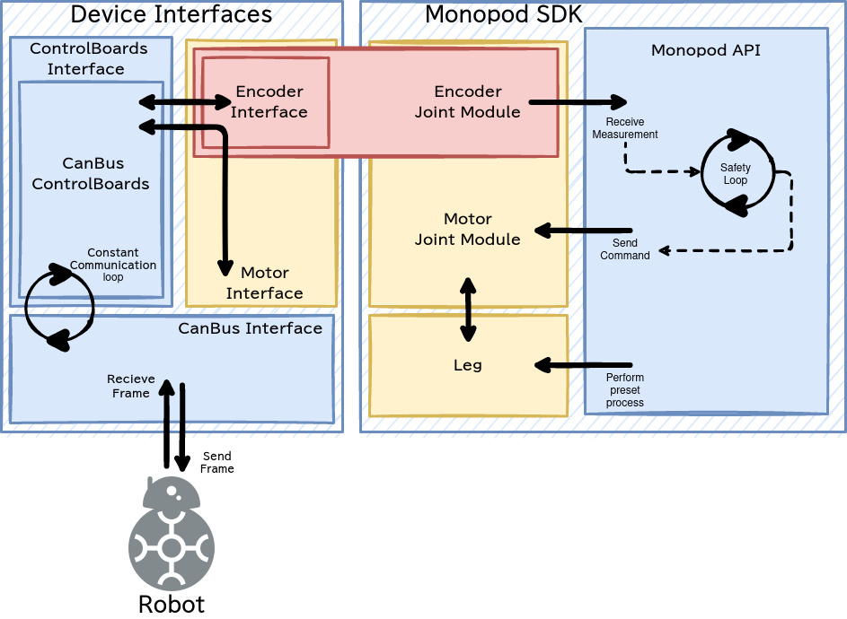

.. _monopod_sdk_software_docs:

===========
monopod sdk
===========

Implements drivers for the physical robot, accompanied by an API to control the
monopod and/or receive measurements from the robot. Additionally, Monopod SDK implements safety
limits that run independently in a separate thread.

Introduction
============

This package contains the drivers for the planarized monopod sim2real platform
designed by ``OpenSim2Real``. These drivers provide an interface to send commands and
receive observations. The drivers will automatically detect if your system has the
real-time kernel enabled and will enable it inside the communication thread.

This package is directly derived from the drivers for the brushless
motors developed in the Max Planck Institute for Intelligent System. The original
source code can be found `here <https://github.com/open-dynamic-robot-initiative/blmc_drivers>`_\ . :footcite:`grimminger2020open`

This package provides a very simple API in order to acquire the sensor data and send
the controls to the actuators.
Example of use of this package can be seen in the different demos
(``PROJECT_SOURCE_DIR/demos``) or in different unittests (``PROJECT_SOURCE_DIR/tests``).
The demos contains the documentation inside the code. The unittests should be
simple enough to understand without additional documentation.

Device Interface
================

The BLMC stands for **B**\ rush\ **L**\ ess **M**\ otor **C**\ ontrol.

This package provides guidelines on how a device should
be implemented (see also the :class:`monopod_drivers::DeviceInterface` class).

generally, we expect the following functions to be implemented:

1.  a set function for each input (several inputs may share a set function
    which takes an index argument).
2.  a ``send_if_input_changed()`` function which will send the inputs to the
    device if any of them have changed.
3.  functions to access the current inputs and outputs, as well as the
    inputs which have been sent to the device. Rather than just returning
    the latest elements, these function should return a time series
    of these objects, such that the user can synchronize (e.g. wait for
    the next element or step through them one by one such that none of them is
    missed)

Package Architecture
====================

The architecture can be easily represented as a diagram. The package is designed
in an abstract way meaning a lot of the components inherent features from other sub-classes.
One example of this is how the :class:`monopod_drivers::MotorInterface` class inherits all the measurement code from
the :class:`monopod_drivers::EncoderInterface` class. This design pattern allows the control boards to be replaced in
the future without having to modify everything upstream.

  ``monopod_sdk`` architecture. Illustrates how inheritence and the flow of information
  is handled between each major component of ``monopod_sdk``. Not all classes have been included
  for clarity. For example, :class:`monopod_drivers::EncoderInterface` was shown without including
  :class:`monopod_drivers::Encoder`.

The top level class which exposes the robot API to the user is :class:`monopod_drivers::Monopod`.

Using Monopod SDK
=================

For a comprehensive tutorial on using ``monopod_sdk`` please visit :ref:`tutorial_using_sdk`. Using
the dummy control board backend we can create a simple script that runs monopod_sdk.

.. note::

  dummy control board is a backend that fakes the real robot control boards class. In the
  figure above it would replace the ``CanBusControlBoards`` class. This is useful for developing
  without requiring a connection to the physical robot. Eventually this dummy class may be improved
  to act as a simple physics engine that will maintain rough positions, etc.

Now to create a simple executable that uses ``monopod_sdk`` with the dummy backend you must first
install ``monopod_sdk`` using the :ref:`superbuild <enable_monopod_sdk>` and
:ref:`source your workspace <superbuild_sourcing>`. Once your workspace has all dependencies
sourced create the following files.

.. tabs::
  .. group-tab:: example.cpp

    .. code-block:: cpp

      #include <math.h>
      #include <monopod_sdk/monopod.hpp>

      #include <atomic>
      #include <fstream>
      #include <signal.h>

      /**
      * @brief This boolean is here to kill cleanly the application upon ctrl+c
      */
      std::atomic_bool StopDemos(false);

      /**
      * @brief This function is the callback upon a ctrl+c call from the terminal.
      *
      * @param s
      */
      void my_handler(int) { StopDemos = true; }

      int main(int, char **) {
      	// make sure we catch the ctrl+c signal to kill the application properly.
      	struct sigaction sigIntHandler;
      	sigIntHandler.sa_handler = my_handler;
      	sigemptyset(&sigIntHandler.sa_mask);
      	sigIntHandler.sa_flags = 0;
      	sigaction(SIGINT, &sigIntHandler, NULL);
      	StopDemos = false;

      	monopod_drivers::Monopod monopod;
      	rt_printf("controllers are set up \n");

      	monopod.initialize(monopod_drivers::Mode::MOTOR_BOARD, /*dummy_mode=*/ true);
      	rt_printf("initialized monopod sdk in dummy mode \n");

      	// Set up max torque target (clamps it to this)
      	monopod.set_max_torque_target(1.5, monopod_drivers::hip_joint);
      	monopod.set_max_torque_target(1.5, monopod_drivers::knee_joint);

      	// example of joint position limit
      	monopod.set_joint_position_limit(/*max=*/ 15, /*min=*/ 15, /*joint_index=*/ monopod_drivers::hip_joint);

      	// Starting safety loops which enforces joint limits
      	monopod.start_safety_loop();

      	/**
      	If monopod entered safemode (limit reached). Physically reset the limits then run,
      	monopod.reset(false); \\move_to_zero=false is parameter
      	*/

      	while (!StopDemos) {

      		// Printing Status
      		rt_printf("\33[H\33[2J"); // clear screen
      		monopod.print();          // print info

      		// Get position Data example
      		auto pos_data = monopod.get_positions().value();

      		fflush(stdout);
      		real_time_tools::Timer::sleep_sec(0.5);

      	} // endwhile

      	return 0;
      }

  .. group-tab:: CMakeLists.txt

    .. code-block:: cmake

      cmake_minimum_required(VERSION 3.16)
      project(ExampleWithMonopod VERSION 1.0)

      set(CMAKE_CXX_STANDARD 17)
      set(CMAKE_CXX_STANDARD_REQUIRED ON)

      find_package(MonopodSdk REQUIRED)

      add_executable(ExampleWithMonopod example.cpp)

      target_link_libraries(ExampleWithMonopod PRIVATE MonopodSdk::MonopodSdk)

Place both files in the same folder. Then run the the following commands to compile and run the executable.

.. code-block:: bash

  # Build executable from source in current directory into ./build location
  cmake -S . -B build
  cmake --build build

  # Run the executable
  ./build/ExampleWithMonopod

The expected behaviour of the executable will be outputting only zero for each measurement. This
is because the dummy back-end only outputs zero for all measurements and only returns success (true) for
each command sent.

.. footbibliography::
