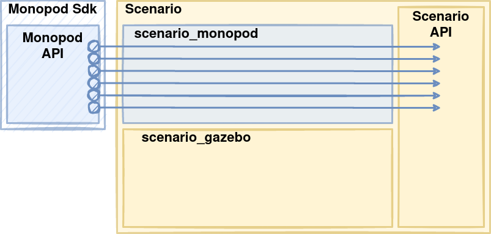

.. _scenario_monopod_software_docs:

================
scenario monopod
================

Scenario is an abstract layer that is used to interface with robots :footcite:`gym_ignition`
by exposing APIs to interact with a scene. The scene is defined as a World object that can
return Model objects. This allows the simulated or physical robot to be implemented as a
separate scenarIO back-end, which can be switched between.

The vanilla scenario package comes with everything required to interface into the
:ref:`ignition gazebo <why_ignition_gazebo>` simulator. Then the ``scenario_monopod`` package
extends this API with the monopod real-time backend.

This allows the physical robot and the simulated robot to be easily switched between
without requiring many changes to the upstream code (most changes are dependency related).

Package Architecture
====================

The architecture can be easily represented as a diagram. This diagram shows how ``scenario_monopod``
simply implements the ``monopod_sdk`` API with the scenario interface. This means that we have both the
simulation and real-time backends in place. Which allow us to write code to control your robot just once,
it will interact either with the simulated or the real robot depending on the ScenarIO backend you enabled.

    Scenario monopod implements the scenario base class using the ``monopod_sdk`` API
    as the real-time backend for the physical robot. THis allows the ``scenario_monopod`` package to
    behave as a extension or plugin for the vanilla ``scenario`` :footcite:`gym_ignition`.

.. tip::

    The interface / implementation pattern is implemented using classic inheritance and
    polymorphism design patterns. Having such unified interface simplifies the process to expose it to
    other languages. Thanks to SWIG, we officially provide Python bindings of ``scenario_monopod``,
    this way you can prototype your applications even faster! In both simulation and real!

Using scenario_monopod
======================

For a comprehensive tutorial on using ``scenario_monopod`` please visit :ref:`tutorial_scenario_monopod`. Using
the dummy control board backend of ``monopod_sdk`` we can create a simple script that uses ``scenario_monopod``
without requiring the physical hardware.

.. note::

  dummy control board is a backend that fakes the real robot control boards class. This is useful for developing
  without requiring a connection to the physical robot. Eventually this dummy class may be improved
  to act as a simple physics engine that will maintain rough positions, etc.

Now to create a simple executable that uses ``scenario_monopod`` with the dummy backend you must first
install ``scenario_monopod`` using the :ref:`superbuild <enable_all>` and
:ref:`source your workspace <superbuild_sourcing>`. Once your workspace has all dependencies
sourced create the following files in their own folder anywhere on your computer.

C++
====
.. tabs::
  .. group-tab:: example.cpp

    .. code-block:: cpp

      #include <scenario/monopod/Joint.h>
      #include <scenario/monopod/Model.h>
      #include <scenario/monopod/World.h>

      #include <chrono>
      #include <iostream>
      #include <string>
      #include <thread>

      int main(int argc, char *argv[]) {

        // Set up the world
        scenario::monopod::World world;
        world.initialize(/*monopod_drivers::Mode=*/monopod_drivers::Mode::MOTOR_BOARD,
                         /*dummy_mode=*/true);

        // Print world name
        std::cout << "World Name: " << world.name() << std::endl;

        // model names from world and model
        auto modelNames = world.modelNames();
        std::cout << "Model Name in world Index 0: " << modelNames[0] << std::endl;
        auto monopod = world.getModel(modelNames[0]);
        std::cout << "Model Name: " << monopod->name() << std::endl;

        // Print joint names from model
        auto jointNames = monopod->jointNames(true);
        std::cout << "joint names: ";
        for (std::string i : jointNames)
          std::cout << i << ", ";
        std::cout << std::endl << std::endl;

        std::vector<double> forces = {1, 2};
        std::vector<std::string> jNames = {"knee_joint", "hip_joint"};

        // Set hip and knee joint to be controllable.
        std::cout << "Setting all joints force controlMode successful? "
                  << monopod->setJointControlMode(
                         scenario::core::JointControlMode::Force, jNames)
                  << std::endl
                  << std::endl;

        // Set force target for hip and knee joint
        bool ok = monopod->setJointGeneralizedForceTargets(forces, jNames);
        std::cout << "Setting force successful? " << ok << std::endl << std::endl;

        // Get meassurements
        auto pos = monopod->jointPositions(jNames);
        std::cout << std::endl << "Joints position: ";
        for (auto i : pos)
          std::cout << i << ", ";
        std::cout << std::endl << std::endl;

        auto vel = monopod->jointVelocities(jNames);
        std::cout << std::endl << "Joints Velocity ";
        for (auto i : vel)
          std::cout << i << ", ";
        std::cout << std::endl << std::endl;

        auto acc = monopod->jointAccelerations(jNames);
        std::cout << std::endl << "Joints Acceleration ";
        for (auto i : acc)
          std::cout << i << ", ";
        std::cout << std::endl << std::endl;

        return 0;
      }

  .. group-tab:: CMakeLists.txt

    .. code-block:: cmake

      cmake_minimum_required(VERSION 3.16)
      project(ExampleWithScenario VERSION 1.0)

      set(CMAKE_CXX_STANDARD 17)
      set(CMAKE_CXX_STANDARD_REQUIRED ON)

      find_package(Scenario COMPONENTS Monopod REQUIRED)

      add_executable(ExampleWithScenario example.cpp)

      target_link_libraries(ExampleWithScenario PRIVATE ScenarioMonopod::ScenarioMonopod)

Place both files in the same folder. Then run the the following commands to compile and run the executable.

.. code-block:: bash

  # Build executable from source in current directory into ./build location
  cmake -S . -B build
  cmake --build build

  # Run the executable
  ./build/ExampleWithScenario

Python
======

Implementing the same code using python bindings instead. This assumes the same
installation instructions were followed as the CPP example.

.. code-block:: python

  from scenario import monopod as scenario
  from scenario import core as scenario_core

  # Create the world
  world = scenario.World()
  modes = {
    "free_hip" : scenario.Mode_free,
    "fixed_hip" : scenario.Mode_fixed_connector,
    "fixed" : scenario.Mode_fixed,
    "simple" : scenario.Mode_motor_board
  }

  world.initialize(modes['simple'], dummy_mode=True)
  print(f"World Name: {world.name()}")

  model_name = world.model_names()[0]
  print(f"Model Name in world Index 0: {model_name}")
  model = world.get_model(model_name)
  print(f"Model Name: {model.name()}")

  Jnames = model.joint_names()
  print(f"joint names: {Jnames}")

  ok = model.set_joint_control_mode(scenario_core.JointControlMode_force, Jnames)
  print(f"Setting all joints force controlMode successful? {ok}")

  forces = [1, 2]
  Jnames = ["knee_joint", "hip_joint"]

  ok = model.set_joint_generalized_force_targets(forces, Jnames)
  print(f"Setting force successful? {ok}")

  pos = model.joint_positions(Jnames)
  vel = model.joint_velocities(Jnames)

  print(f"joints: {Jnames}, Pos: {pos}, Vel: {vel}")

  # To set joint limits you need to convert to derived class. for example,
  model_monopod = scenario.ToMonopodModel(model)
  joint_monopod = scenario.ToMonopodJoint(model.get_joint(Jnames[0]))
  min_lim, max_lim = -10, 10
  joint_monopod.set_joint_position_limit(max_lim, min_lim)

.. footbibliography::
