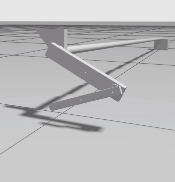

Quick Start
===========

This sections gives simple boilerplate code using :ref:`gym-os2r` to perform a simulation
of the physical monopod. This simulation provides an environment that parallels the physical
properties of the :ref:`real monopod <what_is_our_real>` for reinforcement learning
research compatible with OpenAI Gym.

Following the structure of `gym-ignition <https://robotology.github.io/gym-ignition>`_ we provide
the following classes to train a model for the monopod:

- :py:class:`~gym_os2r.runtime`: Provides the code that deals with real-time execution for
  environments running on the real robot. The implementation for the physical platform is
  :py:class:`~gym_os2r.runtime.realtime_runtime.RealtimeRuntime`.

- :py:class:`~gym_os2r.tasks.monopod`: Provides the structure of the decision-making logic
  for the monopod. The code of the task is independent from the runtime, and only the core
  ScenarIO APIs should be used. The active runtime will then execute the task on either
  simulated or real worlds by selecting the scenario implementation.

- :py:mod:`gym_os2r.randomizers`: Randomizer acts as a ``gym.Wrapper`` class that randomizes
  the simulated environment every rollout. The two randomizes provided are :py:class:`gym_os2r.randomizers.monopod`
  and :py:class:`gym_os2r.randomizers.monopod_no_rand`.

- :py:mod:`gym_os2r.rewards.RewardBase`: Abstract base class that provides a simple interface to implement
  new rewards functions. This class can be passed into the :py:class:`~gym_os2r.tasks.monopod` ``*kwargs``.

A minimal example for ``gym-os2r``. This example creates a monopod environment then
performs random actions.

.. code-block:: python

  import gym
  import time
  import functools
  from gym_ignition.utils import logger

  from gym_os2r import randomizers
  from gym_os2r.common import make_env_from_id
  from gym_os2r.rewards import BalancingV2

  # Set verbosity
  # logger.set_level(gym.logger.ERROR)
  logger.set_level(gym.logger.DEBUG)

  env_id = "Monopod-stand-v1"

  kwargs = {}

  make_env = functools.partial(make_env_from_id, env_id=env_id, **kwargs)

  # env = randomizers.monopod.MonopodEnvRandomizer(env=make_env)
  env = randomizers.monopod_no_rand.MonopodEnvNoRandomizer(env=make_env)

  # Enable the rendering
  env.render('human')

  # Initialize the seed
  env.seed(42)

  for epoch in range(1000):

      # Reset the environment
      observation = env.reset()

      # Initialize returned values
      done = False

      while not done:
          # Execute a random action
          action = env.action_space.sample()
          observation, reward, done, _ = env.step(action)

  env.close()
  time.sleep(5)

Example of the simulation.

The ``gym-os2r`` package provides multiple ``*kwargs`` for ease of customizing the
environment. The available ``*kwargs`` are listed in the attributes of the
:py:class:`~gym_os2r.tasks.monopod` class. The following table concisely lists all the
different options:

+----------------------+----------------------------------------+----------------------------------------------------------------------------------------------------------------------------+-------------------------------------------------------------------------------------------------------+
| Required ``*kwarg``  | Type                                   | Description                                                                                                                | Available Options                                                                                     |
+======================+========================================+============================================================================================================================+=======================================================================================================+
| task_mode            | str                                    | Defines the configured mode of the monopod i.e. how many actuated joints and how many observed joints.                     | ‘free_hip’, ‘fixed_hip’, ‘fixed’, Deprecated Options (‘old-free_hip’, ‘old-fixed_hip’, ‘old-fixed’).  |
+----------------------+----------------------------------------+----------------------------------------------------------------------------------------------------------------------------+-------------------------------------------------------------------------------------------------------+
| reward_class         | :py:mod:`gym_os2r.rewards.RewardBase`  | Defines the reward function for the task. The reward class has access to the previous action and the current observation.  | Provided reward functions: BalancingV1, BalancingV2, StandingV1, WalkingV1.                           |
+----------------------+----------------------------------------+----------------------------------------------------------------------------------------------------------------------------+-------------------------------------------------------------------------------------------------------+
| reset_position       | [str]                                  | Array of allowed positions for the monopod to be reset into. This will be randomly chosen during each reset.               | ‘stand’, ‘half_stand’, ‘ground’, ‘lay’, ‘float’                                                       |
+----------------------+----------------------------------------+----------------------------------------------------------------------------------------------------------------------------+-------------------------------------------------------------------------------------------------------+
